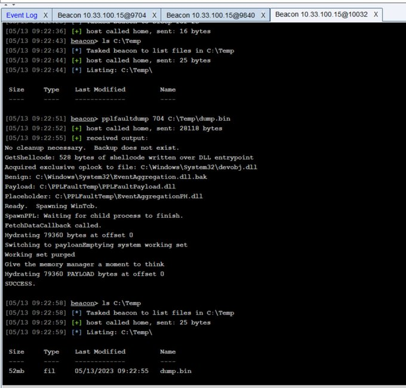

# This is a derivative work of [https://github.com/gabriellandau/PPLFault](https://github.com/gabriellandau/PPLFault). 

Please view that repo for all of the original research and further information
This conversion intentionaly does not modify IOC's of the original tool release.

# PPLFaultDumpBOF

Takes the original PPLFault and the original included DumpShellcode and combinds it all into a BOF targeting cobalt strike.

If you would like to run this in other projects please consider using our BOF runner implementation [COFFLoader](https://github.com/trustedsec/COFFLoader)

## Building

Normally I like to use mingw-w64 to build my BOF's but given that this expolit requires modern version of windows 10 to work, it was easier to convert and compile against cl.exe.

You need to start an x64 native visual studio developer prompt. Then from that prompt run [makebof.bat](PPLFault/makebof.bat)

## Code layout
The layout of this code closely matches the original, but the original solution files are essentially broken.  Start at [entry.c](PPLFault/entry.c) as that is the BOF entry point and where all other .h / .c files are included.

## Example Output

## Usage
First load PPLFault.cna into cobalt strike
Then in any console run `pplfaultdump <pid> <outputpath>`

# License

Silhouette is covered by the [ELv2 license](LICENSE.txt).  It uses [phnt](https://github.com/winsiderss/systeminformer/tree/25846070780183848dc8d8f335a54fa6e636e281/phnt) from SystemInformer under the [MIT license](phnt/LICENSE.txt).

# Credits
Inspired by [PPLdump](https://github.com/itm4n/PPLdump) by [Clément Labro](https://infosec.exchange/@itm4n), which Microsoft [patched](https://itm4n.github.io/the-end-of-ppldump/) in July 2022.

[ANGRYORCHARD](https://github.com/gabriellandau/ANGRYORCHARD) was created by [Austin Hudson](https://twitter.com/ilove2pwn_), who released it when Microsoft patched PPLdump.

 [PPLFault](https://github.com/gabriellandau/PPLFault) From [Gabriel Landau](https://twitter.com/GabrielLandau) at [Elastic Security](https://www.elastic.co/security-labs/)